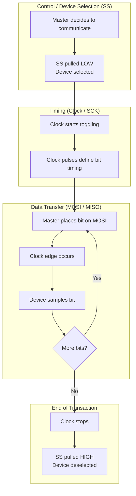
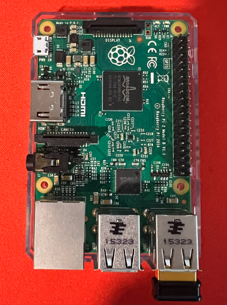
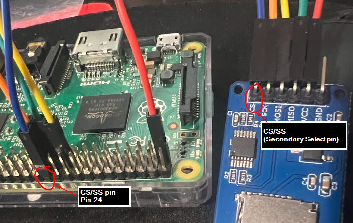
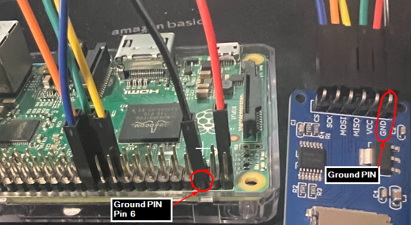
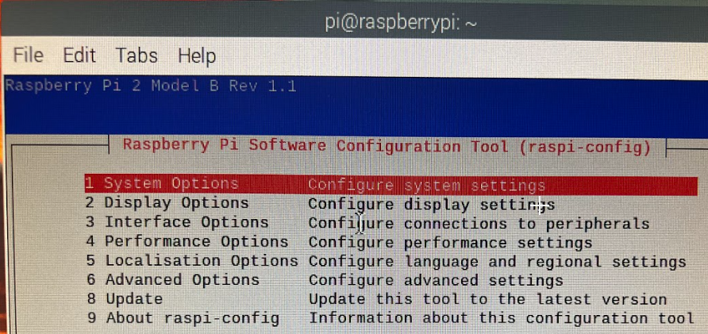
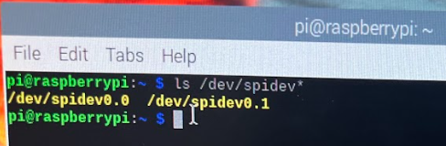

# SPI [Serial Peripheral Interface]


## What is SPI

SPI stands for Serial Peripheral Interface. It's essentially a synchronous serial communication protocol that's used for short-distance communication, typically between a microcontroller (like a Raspberry Pi or an Arduino) and one or more peripheral devices like sensors, SD cards, or other modules. So that's the basic idea!

## Where is it used now?
SPI is used behind the scenes in a lot of common electronics. For instance, if you've got a device with an SD card reader-like a camera or even some smartphones - that SD card reader is probably using SPI to communicate with the main processor. <br/>
Touchscreens in appliances - like a smart fridge panel or a fancy thermostat screen - which often rely on SPI to send data quickly between the controller and the display.

## SPI Architecture
This consists of devices (Master and Secondary) and the signals used between the devices.

### Devices
1. **Master Device** : This controls the communication and provides the clock signal(more on this in the signal section below). 
e.g. A Raspberry Pi or Arduino.<br/>
1. **Secondary Device** : These are the peripheral devices e.g. SD card, Display.

### Signals
1. **SCK (Serial Clock Line)** : Generated by the master device. Every time there is clock pulse, there is data transfer on MOSI/MISO line.
1. **MOSI (Master Out Secondary In)** :  The line that carries data from the master to the secondary device.
1. **MISO (Master In Secondary Out)** :  The line that carries data from the secondary device back to the master.
1. **SS (Secondary Select)** :  The line that is used to select which secondary device you are currently talking to if you have more than one.

### Flow

1. **Select the device (SS)**
The master pulls the SS line low to select the device it wants to communicate with.

1. **Set the timing (Clock)**
The master generates clock pulses that control when data is transferred.

1. **Transfer the data (MOSI / MISO)**
Data is exchanged one bit per clock pulse, with the master sending data on MOSI and the device optionally responding on MISO.

1. **End the communication**
The clock stops and SS is pulled high, ending the transaction.



## The setup
1. Wiring
2. Setting up the Raspberry Pi for SPI
3. Testing without an actual MicroSD card
4. Testing with an actual MicroSD card

## Wiring
The time for action! <br>
I used :

1. [Raspberry PI 2 Model B V 1.1](https://www.raspberrypi.com/products/raspberry-pi-2-model-b/) as master.
1. [MicroSD card adapter](https://a.co/d/80C9VED) as secondary device.
1. [MicroSD card](https://www.amazon.com/dp/B08TJRVWV1)
1. [Jumper wires (female to female)](https://www.amazon.com/dp/B01EV70C78?ref=ppx_yo2ov_dt_b_fed_asin_title)

### Raspberry Pi
One of the most important section in the Pi are the pins. <br/>

| Raspberry Pi      | Pins in the Raspberry Pi                                             |
| ---------------------- | ------------------------------------------------------- |
|  |                                       |


<table>
  <thead>
    <tr>
      <th>Raspberry Pi pins</th>
      <th>INSIDE<br/>(Odd Pins)</th>
      <th>Purpose</th>
      <th>OUTSIDE<br/>(Even Pins)</th>
      <th>Purpose</th>
    </tr>
  </thead>
  <tbody>
    <tr><td  rowspan="21">
    </td></tr>
    <tr>
      <td>Pin 1</td>
      <td>3.3V Power</td>
      <td>Pin 2</td>
      <td>5V Power</td>
    </tr>
    <tr>
      <td>Pin 3</td>
      <td>GPIO2 / I²C SDA1</td>
      <td>Pin 4</td>
      <td>5V Power</td>
    </tr>
    <tr>
      <td>Pin 5</td>
      <td>GPIO3 / I²C SCL1</td>
      <td>Pin 6</td>
      <td>GND</td>
    </tr>
    <tr>
      <td>Pin 7</td>
      <td>GPIO4</td>
      <td>Pin 8</td>
      <td>GPIO14 / UART TXD</td>
    </tr>
    <tr>
      <td>Pin 9</td>
      <td>GND</td>
      <td>Pin 10</td>
      <td>GPIO15 / UART RXD</td>
    </tr>
    <tr>
      <td>Pin 11</td>
      <td>GPIO17</td>
      <td>Pin 12</td>
      <td>GPIO18 / PWM0</td>
    </tr>
    <tr>
      <td>Pin 13</td>
      <td>GPIO27</td>
      <td>Pin 14</td>
      <td>GND</td>
    </tr>
    <tr>
      <td>Pin 15</td>
      <td>GPIO22</td>
      <td>Pin 16</td>
      <td>GPIO23</td>
    </tr>
    <tr>
      <td>Pin 17</td>
      <td>3.3V Power</td>
      <td>Pin 18</td>
      <td>GPIO24</td>
    </tr>
    <tr>
      <td>Pin 19</td>
      <td>GPIO10 / SPI MOSI</td>
      <td>Pin 20</td>
      <td>GND</td>
    </tr>
    <tr>
      <td>Pin 21</td>
      <td>GPIO9 / SPI MISO</td>
      <td>Pin 22</td>
      <td>GPIO25</td>
    </tr>
    <tr>
      <td>Pin 23</td>
      <td>GPIO11 / SPI SCLK</td>
      <td>Pin 24</td>
      <td>GPIO8 / SPI CS0</td>
    </tr>
    <tr>
      <td>Pin 25</td>
      <td>GND</td>
      <td>Pin 26</td>
      <td>GPIO7 / SPI CS1</td>
    </tr>
    <tr>
      <td>Pin 27</td>
      <td>GPIO0 / ID_SD</td>
      <td>Pin 28</td>
      <td>GPIO1 / ID_SC</td>
    </tr>
    <tr>
      <td>Pin 29</td>
      <td>GPIO5</td>
      <td>Pin 30</td>
      <td>GND</td>
    </tr>
    <tr>
      <td>Pin 31</td>
      <td>GPIO6</td>
      <td>Pin 32</td>
      <td>GPIO12 / PWM0</td>
    </tr>
    <tr>
      <td>Pin 33</td>
      <td>GPIO13 / PWM1</td>
      <td>Pin 34</td>
      <td>GND</td>
    </tr>
    <tr>
      <td>Pin 35</td>
      <td>GPIO19 / PCM FS</td>
      <td>Pin 36</td>
      <td>GPIO16</td>
    </tr>
    <tr>
      <td>Pin 37</td>
      <td>GPIO26</td>
      <td>Pin 38</td>
      <td>GPIO20 / PCM DIN</td>
    </tr>
    <tr>
      <td>Pin 39</td>
      <td>GND</td>
      <td>Pin 40</td>
      <td>GPIO21 / PCM DOUT</td>
    </tr>
  </tbody>
</table>

### MicroSD card adapter module

Front and back side of the adapter module showing the CS, MOSI, MISO and SCK pins.
The additional VCC (Voltage at the Common Collector) pin is to supply power from the 3.3V of Raspberry pi.

| Front side    | Back side                                             |
| ---------------------- | ------------------------------------------------------- |
|  |        


### Jumper wires 
In this case we need female to female wires connecting the Raspberry Pi and MicroSD card module pins. <br/>
  

### The wiring
3.3V Pin from Raspberry Pi to VCC pin on the MicroSD module. <br/>

<br/>
MISO/Pin 21 from Raspberry Pi to MISO pin on the MicroSD module. <br/>

<br/>
MOSI/Pin 19 from Raspberry Pi to MOSI pin on the MicroSD module. <br/>

<br/>
SCK(Clock pin)/Pin 23 from Raspberry Pi to SCK pin on the MicroSD module. <br/>

<br/>
CS/SS(Chip Select/Secondary Select pin)/Pin 24 from Raspberry Pi to CS pin on the MicroSD module. <br/>

<br/>
Ground/Pin 6 from Raspberry Pi to GND pin on the MicroSD module. <br/>

<br/>

## Setting up the Raspberry Pi for SPI communication
### Enable the SPI
Connect to the Raspberry pi and open the Raspberry Pi config. <br/>
```
sudo raspi-config
```


<br/>
Go to "System Options" and select "SPI - Enable/disable automatic loading of SPI kernel module".

| System options  | Enable SPI                                             |
| ---------------------- | ------------------------------------------------------- |
|  |        

<br/>
Reboot the Pi. <br/>
```
reboot
```

SPI is now enabled. <br/>
 <br/>

We confirm by looking at the modules available on the Pi filesystem.<br/>

We can confirm and check if the kernel modules related to the SPI are loaded.
```
lsmod | grep spi
```
 <br/>

1. **spi_bcm2835** is the SPI driver specific to the Broadcom chip in the Raspberry Pi. <br/>This tells us the hardware SPI interface is active.
1. **spidev** is the module that creates the /dev/spidev0.0 and /dev/spidev0.1 device files that user programs can interact with.

Below are the interfaces which our Python program (details later below) can open and talk to. <br/>
```
ls /dev/spidev*
```
 <br/>

To be absolutely sure, verify that SPI is enabled in the boot configuration <br/> 
```
cat /boot/config.txt
```
 <br/>

### Test
We now test with a python program If the python can talk to the SPI interfaces. <br/>
For this we first install the module ```python3-spidev```.
```
sudo apt update
sudo apt install python3-spidev
```
We now use the below script to connect to the SPI interface. <br/>
```spi.open(0, 0)``` is using ```spi.open(BUS, CHIP_SELECT)``` <br/>
The *BUS* is the combination of one clock wire (CLK), one send wire (MOSI) and one receive wire (MISO) - we just wired them up between Pi and MicroSD module<br/>
The *CHIP_SELECT* is the device which is connected to the Pi - in out case the MicroSD module.<br/>
0 for both of then just means the number, like index 0 - both of them being the first and only ones.<br/>

```spi.max_speed_hz = 400000``` 
Its very important to understand what this means. <br/>
400,000 Hz means 400,000 clock pulses per second. <br/>
1 clock pulse = 1 bit transferred <br/>
So roughly, 400,000 bits per second.<br/>
"+When you talk over SPI, do NOT toggle the clock faster than 400,000 times per second."

```py linenums="1"
import spidev

spi = spidev.SpiDev()
spi.open(0, 0)      
spi.max_speed_hz = 400000
spi.mode = 0

print("SPI opened successfully")

```


## Sending and Receiving Data over SPI

At this point, the SPI bus is configured and accessible from Python.  
The next step is to understand how data is transferred over SPI using the ```xfer2()``` method.

```
import spidev

spi = spidev.SpiDev()
spi.open(0, 0)
spi.max_speed_hz = 400000
spi.mode = 0

response = spi.xfer2([0xFF])
print(response)

spi.close()

```


```
import time
import spidev
import RPi.GPIO as GPIO

# -----------------------------
# GPIO / SPI constants for Raspberry Pi 2 Model B v1.1
# -----------------------------
CS_GPIO = 8  # GPIO8 is CE0 / physical pin 24

SPI_BUS = 0
SPI_DEVICE = 0  # corresponds to CE0, but we will manually control CS

# -----------------------------
# Helper: pretty print hex
# -----------------------------
def hx(x: int) -> str:
    return f"0x{x:02X}"

# -----------------------------
# SD Command helper:
#   - Sends a 6-byte SD command frame over SPI
#   - Then reads the R1 response (1 byte, where 0x01 is expected for CMD0)
# -----------------------------
def sd_send_command(spi: spidev.SpiDev, cmd: int, arg: int, crc: int, response_tries: int = 20) -> int:
    """
    cmd: command number (e.g., 0 for CMD0)
    arg: 32-bit argument (CMD0 uses 0)
    crc: CRC byte (CMD0 requires 0x95, CMD8 requires 0x87; others often ignore CRC in SPI mode)
    response_tries: how many bytes to clock out while waiting for a non-0xFF response
    """

    # SD command frame in SPI mode is 6 bytes:
    # [0] 0x40 | cmd
    # [1..4] argument (big-endian)
    # [5] CRC
    frame = [
        0x40 | cmd,
        (arg >> 24) & 0xFF,
        (arg >> 16) & 0xFF,
        (arg >> 8) & 0xFF,
        arg & 0xFF,
        crc,
    ]

    # Send the command frame (while CS is LOW)
    spi.xfer2(frame)

    # Now read the R1 response.
    # The SD card may return 0xFF for a few bytes while it processes the command.
    # We keep sending 0xFF just to generate clock pulses so it can reply on MISO.
    for _ in range(response_tries):
        r = spi.xfer2([0xFF])[0]
        if r != 0xFF:
            return r

    # If we never got anything other than 0xFF, treat it as "no response"
    return 0xFF

# -----------------------------
# MAIN
# -----------------------------
def main():
    print("[*] Setting up GPIO for manual Chip Select (CS)...")
    GPIO.setmode(GPIO.BCM)
    GPIO.setup(CS_GPIO, GPIO.OUT, initial=GPIO.HIGH)  # CS HIGH = not selected

    print("[*] Opening SPI device...")
    spi = spidev.SpiDev()
    spi.open(SPI_BUS, SPI_DEVICE)

    # IMPORTANT: we will manually control CS, so tell spidev not to toggle CE0 for us.
    spi.no_cs = True

    # SD cards in SPI mode use:
    spi.mode = 0
    spi.max_speed_hz = 400000  # safe, slow init speed
    spi.bits_per_word = 8

    print("[*] Step 1: Send dummy clocks with CS HIGH (SD card SPI entry requirement)")
    GPIO.output(CS_GPIO, GPIO.HIGH)

    # SD spec wants at least 74 clock cycles with CS high and MOSI high.
    # Sending 10 bytes of 0xFF gives 80 clock cycles (10 * 8).
    spi.xfer2([0xFF] * 10)
    time.sleep(0.01)

    print("[*] Step 2: Send CMD0 with CS LOW (reset + enter SPI mode)")
    GPIO.output(CS_GPIO, GPIO.LOW)
    time.sleep(0.001)

    # CMD0:
    # - cmd = 0
    # - arg = 0
    # - CRC must be 0x95 for CMD0
    r1 = sd_send_command(spi, cmd=0, arg=0x00000000, crc=0x95)

    GPIO.output(CS_GPIO, GPIO.HIGH)  # de-select card after command
    time.sleep(0.01)

    print(f"[*] CMD0 R1 response: {hx(r1)}")

    if r1 == 0x01:
        print("[+] SUCCESS: SD card entered SPI mode (IDLE state = 0x01).")
    elif r1 == 0xFF:
        print("[!] No response (0xFF): card not replying over MISO. Check wiring, CS, power, card seating.")
    elif r1 == 0x00:
        print("[!] Response 0x00: card claims it is not idle. This is unusual for CMD0 at init; check timing/mode.")
    else:
        print("[!] Unexpected response. Still useful for debugging; share it if you want deeper help.")

    print("[*] Cleaning up...")
    spi.close()
    GPIO.cleanup()

if __name__ == "__main__":
    main()

```